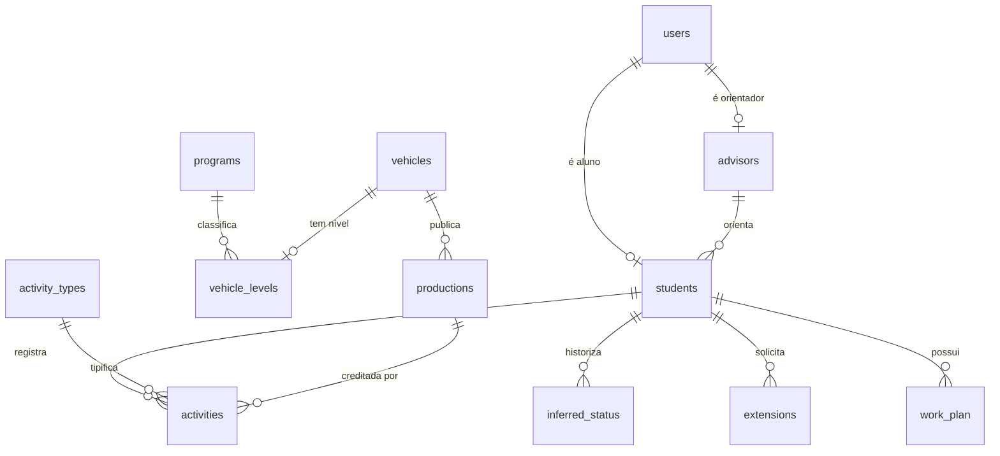
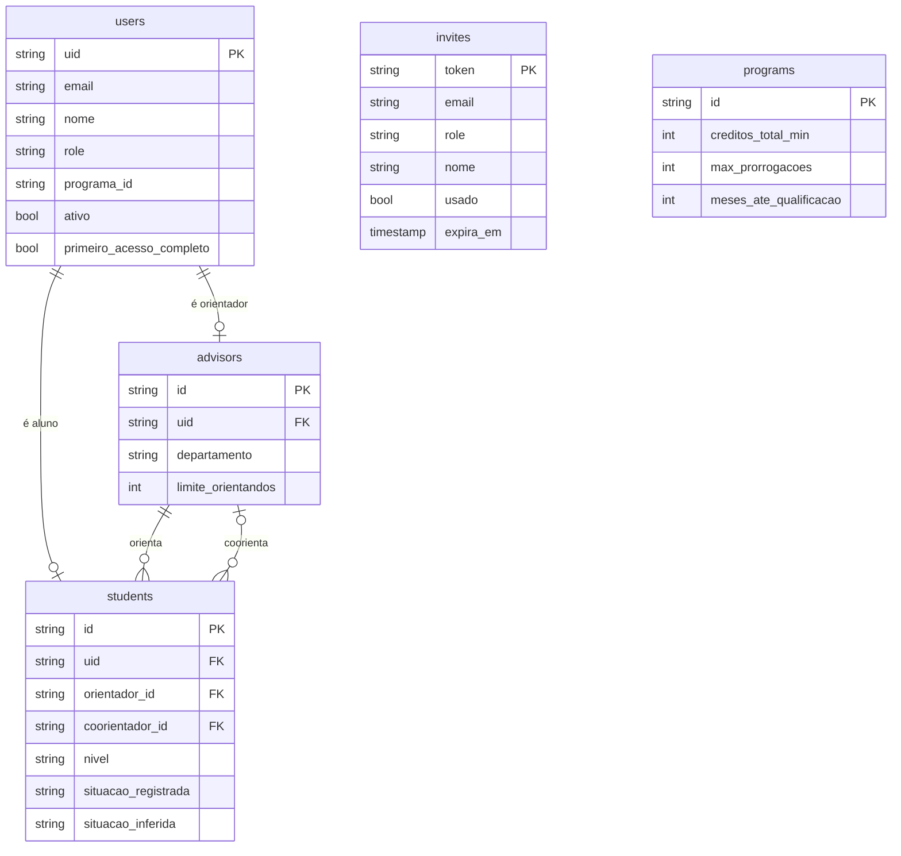
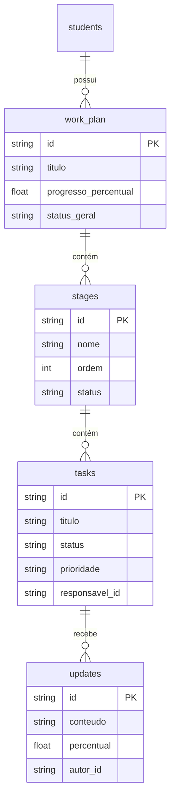
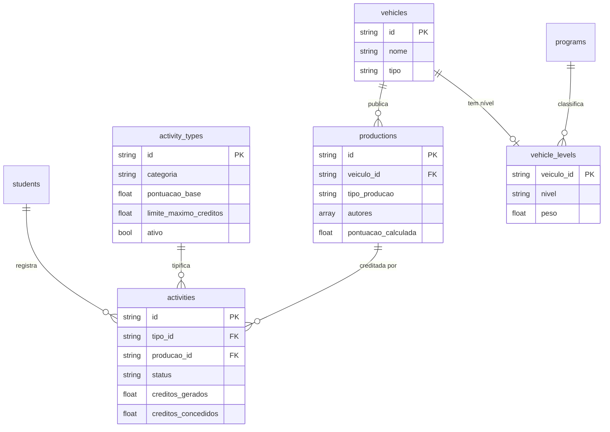
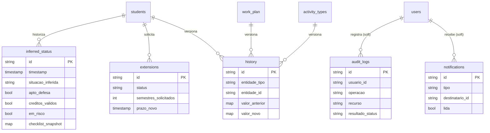

# Modelo de Dados — SAGA

Modelo de dados do Firestore para o SAGA (Sistema de Acompanhamento e Gestão Acadêmica).
Documenta o **modelo completo pretendido**, marcando o que já está implementado vs. planejado.

> **Fonte canônica:** `docs/specs/03_firebase_schema.json`, refinado pelas decisões em
> [`data-model-decisions.md`](./data-model-decisions.md) (sessão de *grill-me*).
> Onde código e spec divergem, o **código em execução vence**.
>
> **Escopo:** apenas backend / Firestore. O motor de inferência (`Atom`, `Variable`,
> `Compound`, `FactBase`) é representação lógica em memória, **não** dados persistidos, e
> fica fora deste documento. Tipos TypeScript do frontend também ficam fora.

---

## Legenda e convenções

**Estado de implementação:**

| Marca | Significado |
|-------|-------------|
| ✅ | Implementado (há código real) |
| 🔲 | Planejado (stub ou ausente) |

Hoje só `users` e `invites` têm código real (`backend/app/models/user.py`, `auth_service.py`).
Todas as demais coleções estão planejadas.

**Convenções aplicadas a todas as coleções:**

- **Chave do documento:** indicada por coleção. Três padrões — `uid` (Firebase Auth),
  `auto-id` (gerado pelo Firestore) e chave natural (`invites`=token UUID,
  `programs`=`prog_default`, `vehicle_levels`=`veiculo_id`).
- **Auditoria:** `criado_em` / `atualizado_em` (Timestamp) e, quando há autoria de
  escrita, `atualizado_por` / `criado_por` (uid). Presentes na maioria das coleções.
- **`programa_id`:** discriminador de tenant (FK lógica a `programs`). Mantém a
  generalização multi-programa, mas é **efetivamente single-tenant no MVP** (`prog_default`).
  Tratado como atributo com nota — **sem aresta** nos diagramas (evita poluição).
- **Campos calculados:** marcados como `calc`. Distinguem-se em *snapshot persistido*
  (ex.: `inferred_status`) e *computado em leitura* (ex.: `orientandos_ativos`).
- **Referências soft polimórficas** (ex.: `recurso`, `entidade_id`): string path, **não**
  FK real — sem aresta nos diagramas.

**Notação dos diagramas (Mermaid `erDiagram`):** as sub-coleções do Firestore são
representadas como entidades ligadas por **composição (1:N)**. Não são FKs relacionais —
são aninhamento de documentos NoSQL. As cardinalidades (`||--o{`, `||--o|`) descrevem a
relação lógica, não constraints impostas pelo banco (o Firestore não impõe integridade
referencial; as invariantes são garantidas nos *services*).

---

## Visão geral (ER macro)

Entidades-âncora e ligações principais, sem atributos.

> A produção (`productions`) é **coleção raiz** (decisão Q8/opção C): um artigo existe
> uma única vez e é creditado a N alunos via `activities.producao_id`. Ver
> [Atividades & Produções](#3-atividades--produções).

---

## 1. Identidade & papéis

Quem são os usuários e como os papéis se materializam.

### Papéis e identidade (modelo de decisão)

- Um `users` é **aluno** (tem `students`), **orientador** (tem `advisors`),
  **coordenador**, ou **coordenador + orientador** (mesmo `uid`, acumula). Aluno nunca acumula.
- `role` é **valor único** = papel de maior privilégio. A capacidade de **orientar** vem da
  **existência do doc `advisors`**, não de `role`. Coordenação engloba as permissões de orientador.
- **Invariante** (garantida no service, não pelo banco): existe doc `advisors` ⟺ o usuário
  pode orientar. Criar/ativar orientador cria o `advisors`; revogar remove. Não há
  `role="orientador"` sem `advisors`.
- `student_id` / `advisor_id` **não** são campos de `users/` — só aparecem em `UserResponse`,
  resolvidos por lookup em leitura.

### `users` ✅ — chave: `uid`

| Campo | Tipo | Ref | Notas |
|-------|------|-----|-------|
| `uid` | string | PK | uid do Firebase Auth |
| `email` | string | | normalizado (trim + minúsculas) |
| `nome` | string | | |
| `role` | string | | enum `aluno`\|`orientador`\|`coordenacao` (papel de maior privilégio) |
| `programa_id` | string | →`programs` (soft) | |
| `ativo` | bool | | |
| `primeiro_acesso_completo` | bool | | persistido; **não exposto** em `UserResponse` |
| `criado_em` / `atualizado_em` | timestamp | | |

### `invites` ✅ — chave: `token` (UUID v4)

| Campo | Tipo | Ref | Notas |
|-------|------|-----|-------|
| `token` | string | PK | UUID do convite |
| `email` | string | | |
| `role` | string | | `aluno`\|`orientador` (coordenação não é criada por convite) |
| `nome` | string | | **incluído** (código grava; origem do `users.nome`) — ausente na spec 03 |
| `programa_id` | string | →`programs` (soft) | |
| `usado` | bool | | |
| `expira_em` | timestamp | | TTL 48h |
| `criado_por` | string | →`users.uid` (soft) | coordenação que emitiu |
| `criado_em` | timestamp | | |

### `students` 🔲 — chave: `auto-id` (entidade central)

| Campo | Tipo | Ref | Notas |
|-------|------|-----|-------|
| `uid` | string | →`users.uid` | identidade |
| `matricula` | string | | |
| `nome` / `email` | string | | |
| `orientador_id` | string | →`advisors` (auto-id) | **não** é o uid |
| `coorientador_id` | string\|null | →`advisors` (0..1) | 2º orientador opcional |
| `programa_id` | string | →`programs` (soft) | |
| `nivel` | string | | `mestrado`\|`doutorado` — **MVP foca mestrado** |
| `data_ingresso` | timestamp | | |
| `prazo_final` | timestamp | | **vigente**; escrito no ingresso **e** por prorrogação aprovada |
| `situacao_registrada` | string | | enum 7 valores¹; escrito **manual** (coordenação) **e** por transições automáticas |
| `situacao_inferida` | string | `calc` | cache do último `inferred_status`; escrito **só pelo motor** |
| `proficiencia_comprovada` | bool | | default false; dispara transição de situação |
| `proficiencia_data` | timestamp\|null | | |
| `qualificacao_aprovada` | bool | | default false; dispara transição de situação |
| `qualificacao_data` | timestamp\|null | | |
| `criado_em` / `atualizado_em` / `atualizado_por` | timestamp / uid | | |

¹ `regular`\|`em_prorrogacao`\|`em_risco`\|`qualificado`\|`fase_defesa`\|`concluido`\|`desligado`.
`situacao_registrada` (humano + transição automática) e `situacao_inferida` (motor) usam o mesmo enum;
a **divergência entre as duas é sinal de atenção**.

### `advisors` 🔲 — chave: `auto-id`

| Campo | Tipo | Ref | Notas |
|-------|------|-----|-------|
| `uid` | string | →`users.uid` | |
| `nome` / `email` | string | | |
| `departamento` | string | | |
| `lattes` | string\|null | | |
| `programa_id` | string | →`programs` (soft) | |
| `limite_orientandos` | int | | default 5 |
| `criado_em` / `atualizado_em` | timestamp | | |
| `orientandos_ativos` | int | `calc` | computado em leitura (contagem de `students` por `orientador_id`) |

### `programs` 🔲 — chave: `prog_default` (singleton de configuração)

Guarda os **fatos de configuração do motor**. `vehicle_levels` é sub-coleção (ver subdomínio 3).

| Campo | Tipo | Notas |
|-------|------|-------|
| `nome` / `instituicao` | string | |
| `duracao_meses` | int | default 24 |
| `creditos_grupo_basico_min` | int | default 12 |
| `creditos_grupo_especifico_min` | int | default 8 |
| `creditos_grupo_tecnologico_max` | int | default 4 |
| `creditos_total_min` | int | default 24 |
| `max_prorrogacoes` | int | default 1 |
| `duracao_prorrogacao_meses` | int | default 6 |
| `meses_ate_qualificacao` | int | default 12 |
| `criado_em` / `atualizado_em` | timestamp | |

---

## 2. Plano de trabalho

Aninhamento profundo sob o aluno: `work_plan → stages → tasks → updates`. Cada nível é
entidade própria (composição 1:N encadeada). `work_plan` é 1:N estrutural — "1 por aluno no MVP".

### `work_plan` 🔲 — sub-coleção de `students` — chave: `auto-id`

| Campo | Tipo | Ref | Notas |
|-------|------|-----|-------|
| `titulo` | string | | |
| `data_inicio` / `data_fim_prevista` | timestamp | | |
| `progresso_percentual` | float | `calc` | 0–100, agregado das tasks |
| `status_geral` | string | | `em_andamento`\|`atrasado`\|`concluido` |
| `criado_por` | string | →`users.uid` (orientador) | |
| `criado_em` / `atualizado_em` | timestamp | | |

### `stages` 🔲 — sub-coleção de `work_plan`

| Campo | Tipo | Notas |
|-------|------|-------|
| `nome` | string | `revisao_bibliografica`\|`definicao_problema`\|`desenvolvimento`\|`experimentos`\|`escrita`\|`qualificacao`\|`defesa` |
| `ordem` | int | |
| `data_inicio` / `data_fim` | timestamp | |
| `status` | string | `pendente`\|`em_andamento`\|`concluida` |
| `criado_por` | string (uid orientador) | |

### `tasks` 🔲 — sub-coleção de `stages`

| Campo | Tipo | Notas |
|-------|------|-------|
| `titulo` / `descricao` | string | |
| `prazo` | timestamp | |
| `status` | string | `pendente`\|`em_andamento`\|`concluida`\|`atrasada` |
| `prioridade` | string | `baixa`\|`media`\|`alta` |
| `responsavel_id` | string | →`users.uid` (aluno) |
| `criado_por` | string | →`users.uid` (orientador) |
| `criado_em` / `atualizado_em` | timestamp | |

### `updates` 🔲 — sub-coleção de `tasks`

| Campo | Tipo | Notas |
|-------|------|-------|
| `conteudo` | string | atualização de progresso |
| `percentual` | float | 0–100 |
| `autor_id` | string | →`users.uid` (aluno) |
| `criado_em` | timestamp | |

---

## 3. Atividades & produções

O módulo de maior densidade de regras. **Decisão estrutural (Q8/opção C):** `productions`
é **coleção raiz** — um artigo existe uma vez e é creditado a N alunos via `activities.producao_id`.

### Subtipo e atribuição de crédito (modelo de decisão)

- **Atividade creditável** = qualquer coisa que gera créditos (disciplina, estágio docência,
  banca, software, artigo). **Produção bibliográfica** = subtipo especial: uma publicação
  ligada a um veículo, com score ponderado (RL05) e que satisfaz a condição de defesa (RL01).
  **Toda produção é atividade; nem toda atividade é produção.**
- Um **artigo** é as duas coisas: tem doc(s) em `activities` (crédito/validação por aluno) **e**
  um doc em `productions` (identidade bibliográfica + score, uma vez).
- **FK invertida (opção C):** `activities.producao_id → productions`. Validação e crédito são
  **por aluno** (cada um tem orientador próprio). **Sem produção órfã**: registrar a produção e a(s)
  atividade(s) é a mesma operação.
- **Crédito: score cheio por autor** (não dividido). A produção guarda `pontuacao_calculada`
  (RL05, uma vez); cada atividade guarda `creditos_gerados` (= score), ajustável por aluno via
  `creditos_concedidos` (coordenação) e capado pelo limite da categoria (RL04) individualmente.
- `productions.autores` aceita **uid de aluno cadastrado E string livre** (autor externo).
  Distinção: `autores` = autoria bibliográfica (inclui externos); `activities.producao_id` =
  quem reivindica crédito (só alunos cadastrados que registraram a atividade).
- Relatórios de "produções do programa" contam `productions` raiz (sem duplicação).

> **Desvio consciente vs. spec 03**, que punha `productions` como sub-coleção de `students`
> referenciando `activity_id`. A opção C inverte a referência e promove `productions` à raiz
> para suportar co-autoria entre alunos sem perda de crédito.

### `activities` 🔲 — sub-coleção de `students` — chave: `auto-id`

| Campo | Tipo | Ref | Notas |
|-------|------|-----|-------|
| `tipo_id` | string | →`activity_types` | |
| `producao_id` | string\|null | →`productions` (raiz) | **só** em atividades bibliográficas |
| `aluno_id` | string | →`students` | |
| `descricao` | string | | |
| `data_realizacao` | timestamp | | |
| `comprovante_url` | string\|null | | URL de download (Firebase Storage) |
| `creditos_gerados` | float | `calc` | default = `pontuacao_base` do tipo |
| `creditos_concedidos` | float\|null | | override da coordenação no `/validate` (sobrescreve crédito) |
| `status` | string | | `rascunho`\|`enviado`\|`aprovado`\|`rejeitado` |
| `parecer_orientador` | string\|null | | **campo**, não estado (ação intermediária) |
| `observacao_coordenacao` | string\|null | | |
| `validado_por` | string\|null | →`users.uid` | |
| `validado_em` | timestamp\|null | | |
| `criado_em` / `atualizado_em` | timestamp | | |

### `productions` 🔲 — **coleção raiz** — chave: `auto-id`

| Campo | Tipo | Ref | Notas |
|-------|------|-----|-------|
| `titulo` | string | | |
| `doi` | string\|null | | chave natural de deduplicação quando presente |
| `veiculo_id` | string | →`vehicles` | |
| `tipo_producao` | string | | `artigo_publicado`\|`artigo_submetido`\|`livro`\|`capitulo` (dimensão bibliográfica) |
| `status_publicacao` | string | | `publicado`\|`submetido`\|`aceito` |
| `observacao` | string\|null | | impactos específicos |
| `autores` | array | →`users.uid` **ou** string livre | inclui autores externos |
| `pontuacao_calculada` | float | `calc` | RL05 = `pontuacao_base × peso_veículo`, uma vez |
| `programa_id` | string | →`programs` (soft) | |
| `criado_em` | timestamp | | |

> A produção **não tem status próprio** — a validação vive nas `activities` que a referenciam.

### `activity_types` 🔲 — **coleção raiz** (config coordenação) — chave: `auto-id`

| Campo | Tipo | Notas |
|-------|------|-------|
| `nome` | string | |
| `categoria` | string | `basico`\|`especifico`\|`tecnologico` |
| `pontuacao_base` | float | base do crédito gerado |
| `limite_maximo_creditos` | float\|null | teto por categoria (RL04) |
| `exige_comprovante` | bool | |
| `permite_multiplas` | bool | |
| `ativo` | bool | default true |
| `programa_id` | string | →`programs` (soft) |
| `criado_por` | string (uid coordenação) | |
| `criado_em` / `atualizado_em` | timestamp | |

> Versionado pelo aspecto A03 (`history`) ao alterar pontuação/limite/ativo.

### `vehicles` 🔲 — **coleção raiz** — chave: `auto-id`

| Campo | Tipo | Notas |
|-------|------|-------|
| `nome` | string | |
| `tipo` | string | `evento`\|`revista` |
| `issn` | string\|null | |
| `sigla` | string\|null | |
| `programa_id` | string | →`programs` (soft) |
| `criado_em` | timestamp | |

### `vehicle_levels` 🔲 — sub-coleção de `programs` — chave: `veiculo_id`

Config de relevância **1:1 opcional (0..1)** com `vehicles` (um veículo pode existir antes de ser classificado).

| Campo | Tipo | Notas |
|-------|------|-------|
| `veiculo_id` | string (PK = id do veículo) | |
| `nivel` | string | `A1`\|`A2`\|`B`\|`C` |
| `peso` | float | A1=2.0, A2=1.5, B=1.0, C=0.5 |
| `atualizado_em` / `atualizado_por` | timestamp / uid | |

> **Sem nível configurado:** RL05 usa **peso default `C` = 0.5** (fallback). Reclassificar recalcula o score.

---

## 4. Inferência & infraestrutura

Snapshots do motor, histórico (A03), auditoria (A02), notificações (A05) e prorrogações.
Coleções transversais geradas por aspectos — **escrita exclusiva via aspecto**.

> **Checklist não é entidade** — é computado ao vivo em `GET /checklist` e fotografado em
> `inferred_status.checklist_snapshot`. As condições da RL01 são booleanos dentro desse map.

### `inferred_status` 🔲 — sub-coleção de `students` — histórico de inferências

| Campo | Tipo | Notas |
|-------|------|-------|
| `timestamp` | timestamp | |
| `situacao_inferida` | string | enum de situação |
| `apto_defesa` | bool | RL01 |
| `creditos_validos` | bool | RL02 |
| `em_risco` | bool | RL03 |
| `checklist_snapshot` | map | cópia do checklist calculado (condições RL01) |
| `fatos_usados` | array | fatos da FactBase usados na inferência |

> Fonte **historizada canônica** da inferência. `students.situacao_inferida` é só o cache do último.

### `extensions` 🔲 — sub-coleção de `students` — prorrogações

| Campo | Tipo | Ref | Notas |
|-------|------|-----|-------|
| `aluno_id` | string | →`students` | |
| `motivo` | string | | |
| `plano_atualizado` | string | | descrição ou link |
| `parecer_orientador` | string\|null | | |
| `semestres_solicitados` | int | | default 1 |
| `status` | string | | `pendente`\|`aprovada`\|`rejeitada` |
| `prazo_novo` | timestamp\|null | | snapshot do novo prazo (se aprovada) — distinto de `students.prazo_final` vigente |
| `aprovado_por` | string\|null | →`users.uid` | |
| `aprovado_em` | timestamp\|null | | |
| `criado_em` | timestamp | | |

> "Prorrogações usadas" = `calc` (contagem de `status="aprovada"`), comparado a
> `programs.max_prorrogacoes` pelo motor. Sem contador persistido.

### `history` 🔲 — sub-coleção **polimórfica** (A03)

Presente sob `students/`, `work_plan/` e `activity_types/`. Uma entidade genérica;
`entidade_tipo`/`entidade_id` discriminam o pai.

| Campo | Tipo | Notas |
|-------|------|-------|
| `entidade_tipo` | string | discriminador |
| `entidade_id` | string | discriminador |
| `valor_anterior` / `valor_novo` | map | snapshot antes/depois |
| `usuario_id` | string | →`users.uid` |
| `role` | string | |
| `timestamp` | timestamp | |

### `audit_logs` 🔲 — **coleção raiz** imutável (A02)

| Campo | Tipo | Notas |
|-------|------|-------|
| `usuario_id` | string | →`users.uid` (soft) |
| `role` | string | |
| `operacao` | string | nome da função Python |
| `modulo` | string | nome do módulo Python |
| `recurso` | string | path soft (ex.: `students/abc123`) — **sem aresta** |
| `valor_entrada` | map | |
| `resultado_status` | string | `sucesso`\|`erro` |
| `erro_mensagem` | string\|null | |
| `timestamp` | timestamp | |
| `duracao_ms` | int | |
| `programa_id` | string | →`programs` (soft) |

> Nunca deletado.

### `notifications` 🔲 — **coleção raiz** (A05)

Única coleção lida **diretamente** pelo frontend (`onSnapshot`).

| Campo | Tipo | Notas |
|-------|------|-------|
| `tipo` | string | `progresso_task`\|`atividade_validada`\|`prorrogacao_aprovada`\|`prazo_critico`\|`atividade_submetida` |
| `titulo` / `mensagem` | string | |
| `destinatario_id` | string | →`users.uid` (soft) |
| `entidade_tipo` / `entidade_id` | string | ref soft polimórfica — **sem aresta** |
| `lida` | bool | default false |
| `timestamp` | timestamp | |
| `programa_id` | string | →`programs` (soft) |

> Índice composto: `(destinatario_id ASC, lida ASC, timestamp DESC)`.

---

## Invariantes de integridade (garantidas no service)

O Firestore não impõe integridade referencial. Estas regras são responsabilidade dos *services*:

1. **Orientador ⟺ `advisors`**: usuário pode orientar se e somente se existe `advisors/{x}.uid == users.uid`.
   Criar orientador cria o doc; revogar remove. Sem `role="orientador"` órfão.
2. **Produção sem órfã**: toda `activities.producao_id` aponta para uma `productions` existente;
   registrar produção + atividade(s) é uma operação atômica.
3. **Papel único + acumulação**: aluno nunca acumula; orientador pode acumular coordenação no mesmo `uid`.
   Perder a última capacidade ⇒ desativar conta (`ativo=false`), nunca `role` vazio.
4. **`prazo_final` vigente**: atualizado no ingresso e a cada prorrogação aprovada; cada
   `extensions.prazo_novo` guarda o histórico.

## Campos calculados (não-entrada do usuário)

| Campo | Coleção | Tipo de cálculo |
|-------|---------|-----------------|
| `situacao_inferida` | `students` | snapshot persistido (cache do último `inferred_status`) — motor |
| `progresso_percentual` | `work_plan` | computado em leitura (agregado das tasks) |
| `creditos_gerados` | `activities` | derivado de `activity_types.pontuacao_base` |
| `pontuacao_calculada` | `productions` | snapshot persistido — RL05 |
| `orientandos_ativos` | (resposta de `advisors`) | computado em leitura (contagem) |
| `apto_defesa` / `creditos_validos` / `em_risco` | `inferred_status` | snapshot persistido — RL01/RL02/RL03 |
| checklist | (não-entidade) | computado ao vivo + fotografado em `inferred_status.checklist_snapshot` |
| prorrogações usadas | (derivado) | computado em leitura (contagem de `extensions` aprovadas) |
